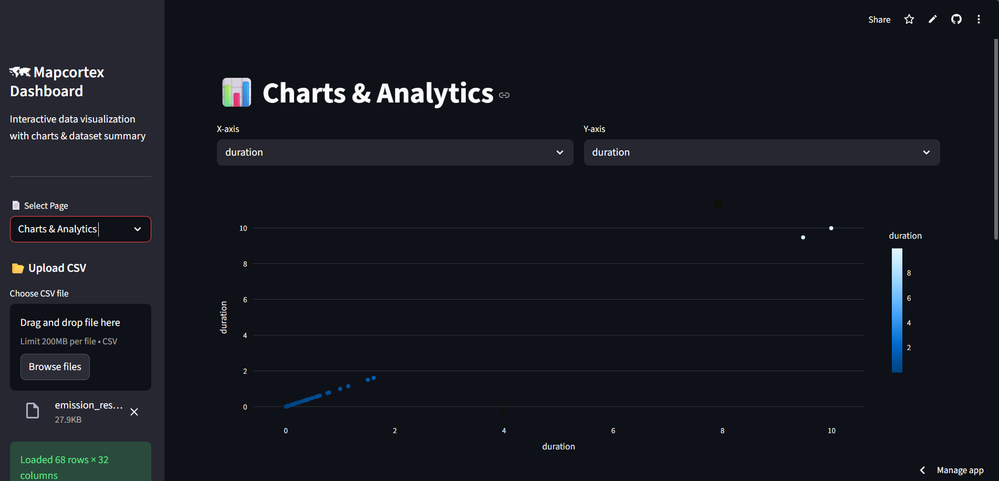

# MapCortex-MapInsights

An interactive dashboard for data analytics and geospatial visualization. Upload datasets, filter and explore data, and uncover insights through dynamic charts and maps.

[](https://opensource.org/licenses/MIT)
[](https://mapcortex-mapinsights.streamlit.app/)


## Problem Statement

Analyzing and visualizing data, especially geospatial data, can be challenging and time-consuming. Existing tools often require specialized knowledge, complex setups, and are not always accessible to users with varying technical backgrounds. This creates a barrier to entry for many individuals and organizations looking to gain insights from their data.


## Introduction

MapCortex-MapInsights is a powerful web application designed to simplify data analytics and geospatial visualization. Built with Python and Streamlit, it allows users to easily upload datasets, apply filters, explore data, and generate insightful visualizations through dynamic charts and maps. Whether you're a data scientist, analyst, researcher, or anyone who needs to derive insights from data, MapCortex-MapInsights provides an intuitive platform to unlock the stories hidden within your data, without requiring extensive technical expertise.

## Features

- **Interactive Dashboard**:
    - A user-friendly interface built with Streamlit, providing an intuitive experience for exploring and analyzing data.
    - Customizable layouts and themes to tailor the dashboard to your specific needs.
- **Data Upload**:
    - Supports various data formats, including CSV, GeoJSON, and Excel files, for easy uploading.
    - Handles large datasets efficiently, allowing you to work with substantial amounts of information.
- **Data Filtering**:
    - Apply multiple filters simultaneously to focus on specific subsets of your data.
    - Filter data based on various criteria, such as date ranges, numerical values, and categorical selections.
- **Dynamic Charts**:
    - Generate a variety of chart types, including line charts, bar charts, scatter plots, histograms, and pie charts, to visualize trends and patterns.
    - Customize chart appearance with options for colors, labels, and tooltips.
- **Data Transformation**:
    - Basic data transformation capabilities such as column renaming, data type conversion, and aggregation.
- **Exporting**:
    - Export visualizations and processed data in common formats like CSV, PNG, and PDF.
- **Streamlit Integration**:
    - Built on Streamlit for easy deployment and sharing, allowing you to quickly deploy the application to various platforms.


## Dashboard 



## Installation

To get started with MapCortex-MapInsights, follow these steps:

1.  **Clone the repository:**

    ```bash
    git clone https://github.com/mekhushi/MapCortex-MapInsights.git
    cd MapCortex-MapInsights
    ```

2.  **Create a virtual environment (recommended):**

    ```bash
    python -m venv venv
    source venv/bin/activate  
    venv\Scripts\activate  
    ```

3.  **Install the dependencies:**

    ```bash
    pip install -r requirements.txt
    ```

## Usage

1.  **Run the Streamlit application:**

    ```bash
    streamlit run app.py
    ```

2.  **Open the application in your browser**: Navigate to the URL provided by Streamlit (usually `http://localhost:8501`).

3.  **Upload your dataset**: Use the file upload feature to load your data into the application.

4.  **Explore and visualize**: Use the various interactive widgets to filter, analyze, and visualize your data.

## Contributing

Contributions are welcome! Here's how you can contribute:

1.  **Fork the repository**.
2.  **Create a new branch** for your feature or bug fix.
3.  **Make your changes** and ensure they are well-tested.
4.  **Submit a pull request** with a clear description of your changes.

## License

This project is licensed under the MIT License - see the [LICENSE](LICENSE) file for details.

## Contact

Khushi singh - [mekhushi](https://github.com/mekhushi) - mekhushisingh27@gmail.com
